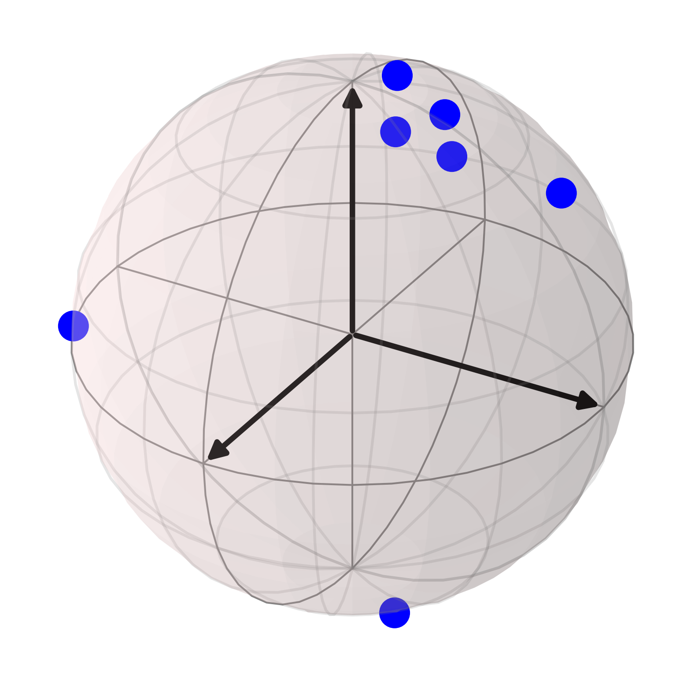
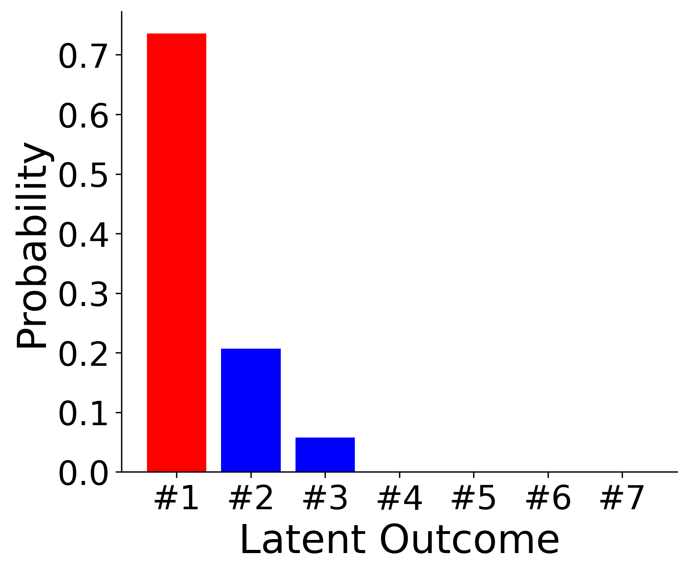
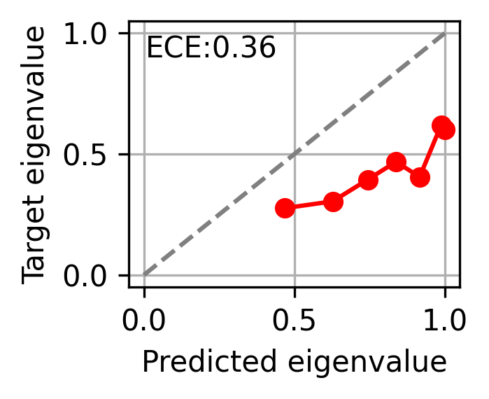
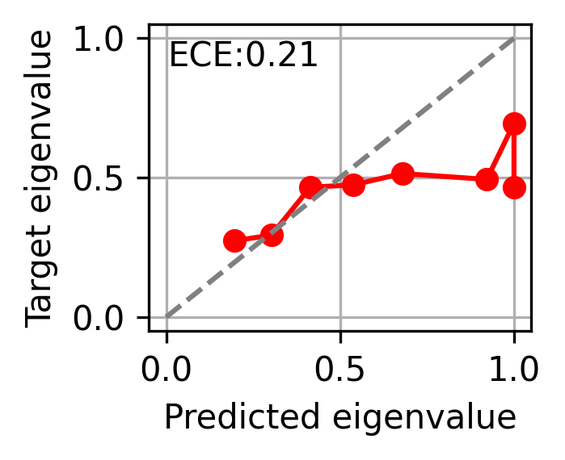

# Eigenvalue Calibration for Semantic Embeddings of Large Language Models

Official code for our UAI 2026 paper **"Eigenvalue Calibration for Semantic Embeddings of Large Language Models"**.

**Sebastian G. Gruber<sup>†</sup>, Nassim Walha<sup>†</sup>, Francis Bach, Florian Buettner** (<sup>†</sup> equal contribution)

Uncertainty quantification for LLMs increasingly relies on the eigenvalues of density matrices built from semantic embeddings of generated answers — but conventional calibration theory for classification probabilities does not transfer to eigenvalues. This repository provides the code for our framework that:

- interprets an LLM + semantic embedding model as a **density matrix predictor**, and defines **matrix** and **eigenvalue calibration** for it,
- proves an **entropy–risk equivalence** under calibration and a central **eigenvalue calibration inequality**,
- shows that **matrix temperature scaling** of eigenvalues provably optimizes calibration when minimizing proper matrix score risk, and
- introduces a **clustering-based reliability diagram** for visualizing eigenvalue calibration.

Across TriviaQA and Natural Questions with Phi-4, Phi-4 Mini, and Llama4 Maverick, we find that current LLMs are **systematically overconfident** in their maximum eigenvalue, and that our temperature scaling reduces this overconfidence while also improving downstream AUROC in most settings.

## Key idea

We treat the eigenvalues of the density matrix $d(x) = \mathbb{E}_{a \sim f(x)}[e(a)e(a)^\intercal]$ (built from an LLM $f$'s sampled answers and their semantic embeddings $e$) as probabilities over latent semantic outcomes, and calibrate them via temperature scaling on the spectrum.

<p align="center">
  
  
</p>

Normalised semantic embeddings reside on a hypersphere (left); we interpret the eigenvalues of their density matrix as probabilities of latent semantic outcomes (right).

LLMs are consistently overconfident in their predicted maximum eigenvalue — our matrix temperature scaling corrects this, lowering the expected calibration error (ECE) of the reliability diagram:

<p align="center">
  
  
</p>

Reliability diagrams for Phi-4 Mini on TriviaQA, before (left, ECE 0.36) and after (right, ECE 0.21) matrix temperature scaling.

## Citation

If you find this work useful, please cite:

```bibtex
@inproceedings{gruber2026eigenvalue,
  title     = {Eigenvalue Calibration for Semantic Embeddings of Large Language Models},
  author    = {Gruber, Sebastian G. and Walha, Nassim and Bach, Francis and Buettner, Florian},
  booktitle = {Proceedings of the 42nd Conference on Uncertainty in Artificial Intelligence (UAI)},
  year      = {2026}
}
```

## To Reproduce our Results

All evaluation outputs are presented in the Jupyter Notebooks `main.ipynb` and `rebuttal_experiments.ipynb` for an easier and more interactive exploration of our experiments.
Set up the environment first, either via conda (`conda env create -f environment.yml`) or pip (`pip install -r requirements.txt`); both contain the minimal set of packages needed to run the notebooks and scripts.
The simulations are light-weight and can be easily run on a low-budget laptop.
If you want to run the LLM answer-generation scripts on GPU, install a CUDA-enabled build of `torch` matching your driver from [pytorch.org](https://pytorch.org/get-started/locally/).

### Real-world Experiments
Before you run the respective cells with real-world experiments in the notebook, you can download the respective answers and embeddings as a dataset to avoid computational costs.
Either manually download from the link in the following, or install `conda install -c conda-forge gdown`.
Then, to download the zipped LLM answers, run `gdown https://drive.google.com/uc?id=1PZmFnbQuLqr_WGxpASPugeM4IzpAoHjY`.

To extract them into the folder `data` run `unzip data.zip -d data`.
